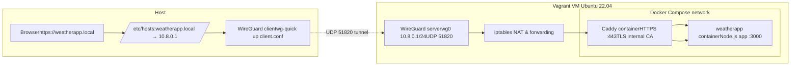

```mermaid

flowchart LR
  subgraph Host
    BROWSER[Browserhttps://weatherapp.local]
    HOSTS[/etc/hosts:weatherapp.local → 10.8.0.1/]
    WGCLI[WireGuard clientwg-quick up client.conf]
    BROWSER --> HOSTS --> WGCLI
  end

  subgraph VM[Vagrant VM Ubuntu 22.04]
    WG[WireGuard serverwg0 10.8.0.1/24UDP 51820]
    IPT[iptables NAT & forwarding]

    subgraph Docker[Docker Compose network]
      Caddy[Caddy containerHTTPS :443TLS internal CA]
      App[weatherapp containerNode.js app :3000]
      Caddy --> App
    end

    WG --> IPT --> Caddy
  end

  WGCLI -. UDP 51820 tunnel .-> WG
  Caddy --> App
```
